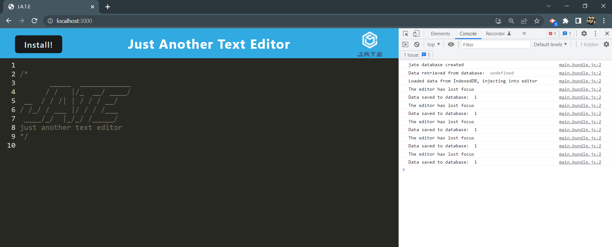
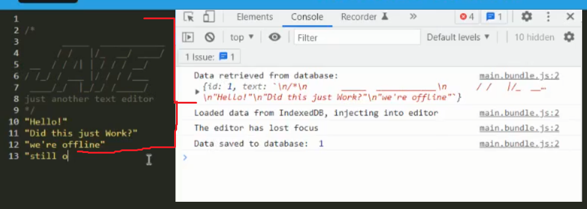

# Text Editor

## Description
A simple text editor that can be installed to your local computer. The application can run offline, and then update/sync once online connection is restored.    

 ## Table of Contents:

  **[How to Use](#how-to-use)**  
  **[Application Demos](#application-demos)**  
  **[Link to Deployed Page](#link-to-deployed-page)**  
  **[References](#references)**  
  **[Devlopment Process](#development-process)**  
  **[Author](#author)**  

## How to Use:
* Enter text into desired fields  
* Click the 'Install!' box or use the icon in the search bar to install locally allowing for offline use  
* In the events of offline usage, connect to online to update your database  

## Application Demos:
<h2 align="center">Welcome to J.A.T.E.</h2>

   
<h2 align="center">Object Saved using IndexedDb</h2>

   
<h2 align="center">Offline mode</h2>

  

<a href="https://drive.google.com/file/d/1PlX7rhruJsxGkprgESBtd17WHPxvPSEu/view">Video Demo</a>

## Link to Deployed Page:
https://timzebra-texteditor.herokuapp.com/

## References:
* Base understanding of code obtained from UTA Bootcamp Section #19 PWA - Mini-Project

## Development Process:
1. Created list of requirements
2. Created list of files with missing code
3. Applied code as requested by previous pseudocode
4. Created process to effectively test changes
5. See commits for more details

## Author:
Created by Timothy Zalewski | Deployed on [GitHub](https://github.com/Tim-Zebra)